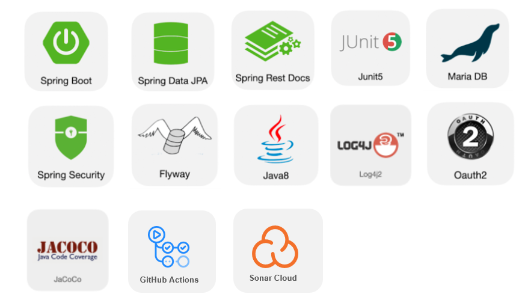

## 프로젝트 소개

**Helenee**는 칼로리 정보를 통해 효율적으로 식단을 계획하고, SNS 기능을 통해 다른 사람들과 식단을 공유할 수 있는 서비스입니다.

## 팀원

- [RIVERKIM](https://github.com/RIVERKIM)
- [RetepMil](https://github.com/RetepMil)
- [Yup](https://github.com/Sangyups)
- [AjiC](https://github.com/jungin0507)

## 개발 요구사항
- https://www.notion.so/Helenee-d3440ee7fdb74f9cb8f2ad5cb1fef596

## 💻기술 스택

## 🛠Infrastructure

### CI Pipeline

### CD Pipeline

### 무중단 배포

## 📌Demo

- **식단 계획 페이지**

- **음식 검색 페이지**

- **식단 공유 페이지**

- **마이 페이지**

